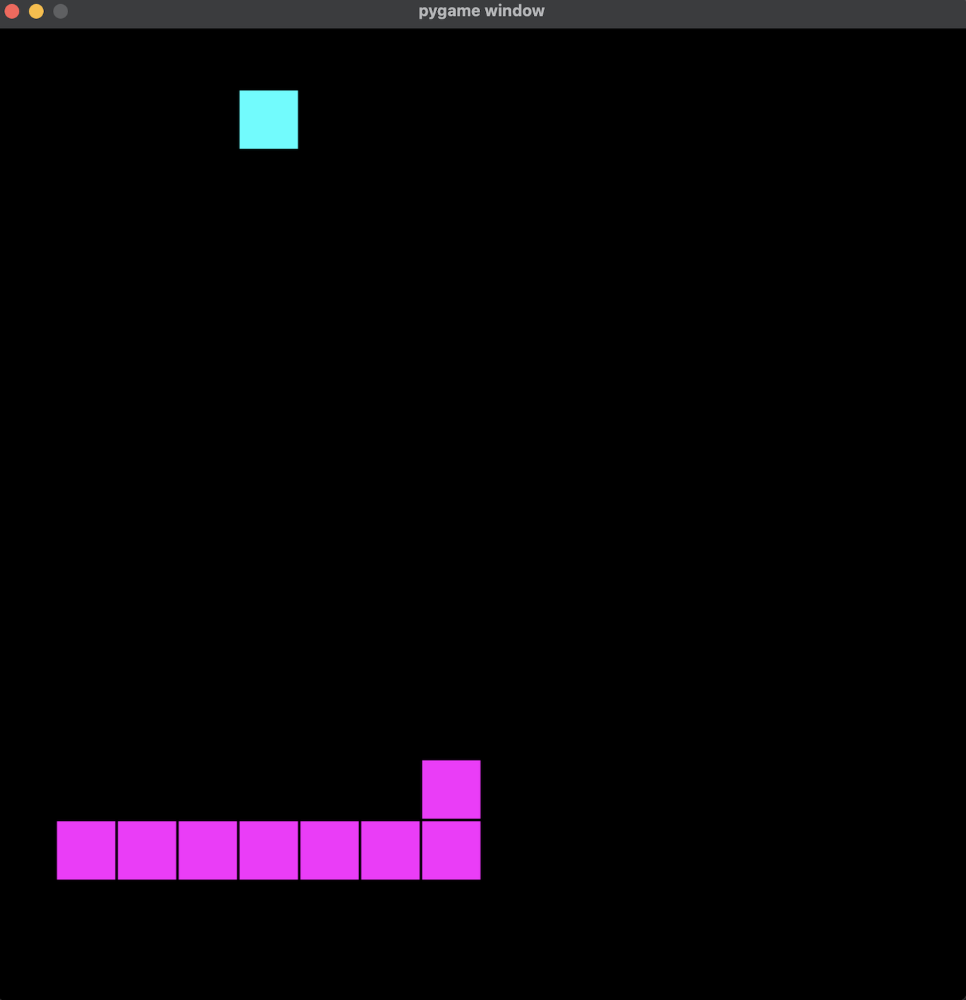

> The classic game of snake...written in Python! Couldn't imagine anything more fitting.

# Snake

Welcome to this pygame! It is the classic game of snake made with Python. I figured the pun was too hard to resist. If you would like to play, I have included instructions below. Enjoy!



## Objective:
You want to make the longest snake possible by eating the food that appears on the screen. You are the magenta snake devouring cyan food pellets.

You must do so while avoiding the following:
- Going out of bounds
- Self-eating (having the snake go into itself)

Doing either of the above will cause the game to reset. Careful!

## How to play:
First, you will need to do the following:

1. Fork and clone this repo
2. Open the code up in your favorite text editor. I use [Visual Studio Code](https://code.visualstudio.com/). 
3. Install the dependencies by typing the following code into your terminal:
```
pip download -r requirements.txt
```
4. Then, run the program by typing the following into the terminal:
```
python3 snake.py 
```
Once you have done the above, you can then play the game! It will start when you make your first move. See below for more detailed instructions on movement. 

You can use wasd keys to move or the arrow keys! You must navigate the grid using these keys and you are forbidden from going out of bounds and from going in the opposite direction of the one you are initially going in (if going left, you cannot go right, you must go another direction first).

Directions:
- w or ↑: moves the snake **_up_**
- s or ↓: moves the snake **_down_**
- a or ←: moves the snake **_left_**
- d or →: moves the snake **_right_**

---

---

## Connect with me

Like the game? Notice any bugs? Wanna chat? Here's my [LinkedIn](https://www.linkedin.com/in/justin-sotolongo/)! I am always open to feedback :)